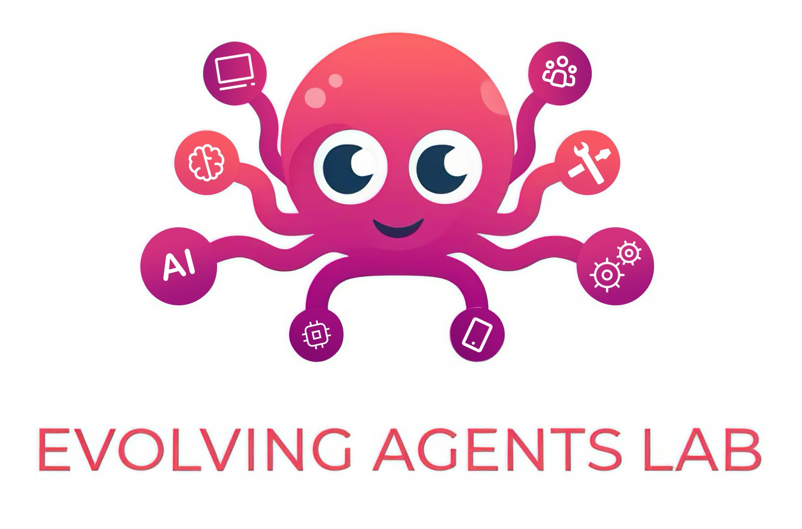

# Evolving Agents Labs 🧪

*Building the future of intelligent agents through experimental research and open collaboration*

> 🌐 **Visit our research lab**: [**evolvingagentslabs.github.io**](https://evolvingagentslabs.github.io)

---

## About Our Research

We explore early-stage concepts in adaptive AI through experimental frameworks and research prototypes. Our work investigates how intelligent agents might adapt, learn, and evolve their behavior based on context, user interaction, and accumulated experience.

---

## 🧪 Current Experiments

### [LLMunix](https://github.com/EvolvingAgentsLabs/llmunix) 
**Experimental Pure Markdown Operating System based in Agents**

### [AI MarkDown Agent framework](https://github.com/EvolvingAgentsLabs/framework-core) 
**Experimental Pure Markdown Agentic Framework**

### 🔬 EAX Protocol Suite

#### [EAX Router](https://github.com/EvolvingAgentsLabs/eax-router) 
**Intelligent LLM Routing Layer**

### [EAX Marketplace](https://github.com/EvolvingAgentsLabs/eax-marketplace) 
**Decentralized Agent Collaboration Protocol**

### [SAL-CP](https://github.com/EvolvingAgentsLabs/sal-cp) 
**Self-Aware LLM Communication Protocol**

---

## 🔬 Research Areas

| Focus Area | Description |
|------------|-------------|
| **Adaptive Behavior Research** | How agents might modify decision-making based on context and interaction patterns |
| **Intelligent Routing & Selection** | Dynamic model and agent selection systems optimizing for cost, latency, or quality |
| **Agent Collaboration Protocols** | Communication and coordination protocols for decentralized multi-agent systems |
| **Memory System Experiments** | Structured experience databases with pattern recognition capabilities |
| **Contextual Communication** | Rich context messaging protocols for effective agent-to-agent collaboration |
| **Sentient State Architecture** | Novel patterns combining data, logic, and evolving behavioral constraints |

## 📫 Connect

**Research Contributors**: [Matias Molinas](https://github.com/matiasmolinas) • [Ismael Faro](https://github.com/ismaelfaro)

