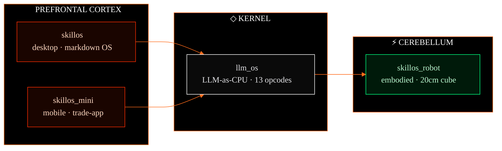
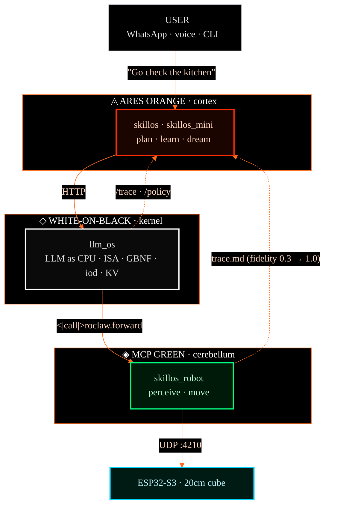

<!--
  EvolvingAgentsLabs — organization profile.
  Tron Ares aesthetic at the org level (orange/red signature),
  with each project card transitioning from a real-world line-art
  rendering on the left to that project's terminal aesthetic on the
  right. Inspired by ART+COM's Chronos XXI — abstract digital matter
  meeting physical form.
-->

<p align="center">
  
</p>

<p align="center">
  <strong><code>EVOLVING AGENTS LABS</code></strong> &nbsp;//&nbsp; on-device adaptive AI · open · permanently alpha.<br/>
  <sub>Four research experiments mapping a biological cognitive stack onto local LLMs.</sub>
</p>

<p align="center">
  <a href="https://github.com/EvolvingAgentsLabs"></a>
  <a href="#"></a>
  <a href="#"></a>
  <a href="#"></a>
</p>

<p align="center">
  
</p>

## ▸ what we build

We build a **biological cognitive stack** on top of local LLMs. The
mapping is intentional — three brain regions, four repos, one runtime
substrate:


```mermaid
%%{init: {'theme':'base', 'themeVariables': {
  'primaryColor':'#1a0500','primaryTextColor':'#ffd9c2','primaryBorderColor':'#ff2d00',
  'lineColor':'#ff6b1a','secondaryColor':'#001a14','tertiaryColor':'#000',
  'background':'#000','mainBkg':'#1a0500',
  'clusterBkg':'#000','clusterBorder':'#ff6b1a',
  'edgeLabelBackground':'#000',
  'fontFamily':'ui-monospace, SF Mono, Menlo, Consolas, monospace'
}}}%%
flowchart LR
    subgraph Cortex["🧠 PREFRONTAL CORTEX"]
        Skl["skillos<br/>desktop · markdown OS"]
        SklM["skillos_mini<br/>mobile · trade-app"]
    end
    subgraph Cereb["⚡ CEREBELLUM"]
        RC["skillos_robot<br/>embodied · 20cm cube"]
    end
    subgraph Kern["◇ KERNEL"]
        LO["llm_os<br/>LLM-as-CPU · 13 opcodes"]
    end
    Skl  --> LO
    SklM --> LO
    LO   --> RC

    classDef ares fill:#1a0500,stroke:#ff2d00,color:#ffd9c2;
    classDef mcp  fill:#001a0a,stroke:#00ff7f,color:#bbf7d0;
    classDef ker  fill:#0a0a0a,stroke:#ffffff,color:#e4e4e7;
    class Skl,SklM ares;
    class RC mcp;
    class LO ker;
```

Each repo is independently shippable. They are also **paired** — a goal
typed into `skillos` plans through `llm_os` and acts on the world
through `skillos_robot`. Each layer is swappable.

> **Permanently alpha.** Every repo here is a research experiment,
> not a product. We ship breaking changes, partial implementations,
> and "thesis-first" documentation. The thesis matters more than
> backwards compatibility — at this stage.

<p align="center">
  
</p>

## ▸ the four active projects

Each card below shows the **transition from real-world to terminal**
— the physical thing on the left, the live runtime on the right, with
particle streams and a digitization scan line bridging them.

<p align="center">
  <a href="https://github.com/EvolvingAgentsLabs/skillos">
    
  </a>
</p>

### [skillos](https://github.com/EvolvingAgentsLabs/skillos) &nbsp;·&nbsp; <code>cortex · desktop</code>

A **pure markdown operating system** designed to run on multiple AI
runtime engines. Compatible with Claude Code, Gemini CLI, and Qwen
Code. Define an agent once with a high-end model, execute it forever
on a 2 GB local model. Dream consolidation, evolving memory, multi-tier
strategy retrieval — all expressed as markdown files the runtime walks
on every dispatch.

```
$ skillos execute "Run the RoClaw Dream Consolidation scenario"
[OK] markdown agents       ▸ RoClawNavigationAgent · RoClawSceneAnalysisAgent
[OK] dream consolidation   ▸ traces/sim3d/*.md  →  strategies/*.md
[OK] evolving memory       ▸ persistent · weighted by fidelity
```

<p align="center">
  <a href="https://github.com/EvolvingAgentsLabs/skillos_mini">
    
  </a>
</p>

### [skillos_mini](https://github.com/EvolvingAgentsLabs/skillos_mini) &nbsp;·&nbsp; <code>cortex · mobile</code>

The mobile-first, on-device port of the SkillOS family — a
**Capacitor + Svelte 5** Android application driving Gemma 4 E2B vision
locally via LiteRT. First commercial vertical: a trade-app for
Spanish-speaking tradespeople (electricista, plomero, pintor) that
captures photos, runs a vision diagnosis on-device, generates a
branded PDF, and shares it by WhatsApp. **No backend.** Photos never
leave the device until the user taps share.

```
[OK] cartridges    ▸ trade-electricista · trade-plomero · trade-pintor
[OK] vision        ▸ gemma-4-e2b.litertlm  · on-device · ~200 ms
[OK] tests         ▸ 278 / 278 green  ·  svelte-check 0 errors
```

<p align="center">
  <a href="https://github.com/EvolvingAgentsLabs/skillos_robot">
    
  </a>
</p>

### [skillos_robot](https://github.com/EvolvingAgentsLabs/skillos_robot) &nbsp;·&nbsp; <code>cerebellum · embodied</code>

A **20 cm cube robot** powered by ESP32-S3 + 28BYJ-48 stepper motors,
driven by a vision language model running on-device. Five-tier stack:
ReflexGuard collision veto at L0, an 8-byte UDP ISA at L1, Qwen3-VL-2B
distilled from Gemini Robotics-ER at L2, scene graph + reactive
controller at L3, skillos planning at L4. The robot dreams overnight
in MuJoCo, retries failed runs, fine-tunes a LoRA, and hot-swaps the
new GGUF into Ollama by morning.

```
$ npm run sim:3d -- --ollama --goal "navigate to the red cube"
[OK] qwen3-vl-2b           ▸ on-device · 200 ms / frame
[OK] scene_graph           ▸ ReactiveController · ReflexGuard shadow
[OK] esp32-s3              ▸ udp :4210 · 8-byte ISA v2 · ack 38ms
```

<p align="center">
  <a href="https://github.com/EvolvingAgentsLabs/llm_os">
    
  </a>
</p>

### [llm_os](https://github.com/EvolvingAgentsLabs/llm_os) &nbsp;·&nbsp; <code>kernel · ground-up</code>

Not an agent framework. An **operating system architecture** where the
LLM itself plays the role of the CPU and the rest of the runtime is
built around it the way Linux is built around x86. 13-opcode ISA over
GBNF grammar (sampler-enforced — invalid sequences are physically
impossible to emit). KV cache as RAM. Compaction as swap. Logit bias
as Ring 0/Ring 3 privileges. 8 Hz on a Raspberry Pi 5; 200 Hz on a
cloud A100. Same ISA, same grammar, same cartridges.

```
$ ./scripts/quickstart.sh
[OK] llama.cpp     ▸ qwen-2.5-3b-q4 · 4×NEON · ctx=8192
[OK] grammar       ▸ isa.gbnf · 13 opcodes · 12/12 fixtures green
[OK] iod daemon    ▸ /dispatch /trace /policy
[OK] cartridges    ▸ 6 mounted · system · io · sim · domestic
```

<p align="center">
  
</p>

## ▸ how the four fit together


```mermaid
%%{init: {'theme':'base', 'themeVariables': {
  'primaryColor':'#1a0500','primaryTextColor':'#ffd9c2','primaryBorderColor':'#ff2d00',
  'lineColor':'#ff6b1a','secondaryColor':'#001a14','tertiaryColor':'#000',
  'background':'#000','mainBkg':'#1a0500',
  'clusterBkg':'#000','clusterBorder':'#ff6b1a',
  'edgeLabelBackground':'#000',
  'fontFamily':'ui-monospace, SF Mono, Menlo, Consolas, monospace'
}}}%%
flowchart TB
    User["💬 USER<br/>WhatsApp · voice · CLI"] -- "&quot;Go check the kitchen&quot;" --> Cortex
    subgraph Cortex_Layer ["◬ ARES ORANGE · cortex"]
        Cortex["skillos · skillos_mini<br/>plan · learn · dream"]
    end
    Cortex -- "HTTP" --> Kernel
    subgraph Kernel_Layer ["◇ WHITE-ON-BLACK · kernel"]
        Kernel["llm_os<br/>LLM as CPU · ISA · GBNF · iod · KV"]
    end
    Kernel -- "&lt;|call|&gt;roclaw.forward" --> Cereb
    subgraph Cereb_Layer ["◈ MCP GREEN · cerebellum"]
        Cereb["skillos_robot<br/>perceive · move"]
    end
    Cereb -- "UDP :4210" --> HW["🦾 ESP32-S3 · 20cm cube"]

    Cereb -. "trace.md (fidelity 0.3 → 1.0)" .-> Cortex
    Kernel -. "/trace · /policy" .-> Cortex

    classDef cortexCls fill:#1a0500,stroke:#ff2d00,color:#ffd9c2,stroke-width:2px;
    classDef kernCls   fill:#0a0a0a,stroke:#ffffff,color:#e4e4e7,stroke-width:2px;
    classDef cerebCls  fill:#001a0a,stroke:#00ff7f,color:#bbf7d0,stroke-width:2px;
    classDef hwCls     fill:#001a14,stroke:#00d4ff,color:#bff7ff,stroke-width:2px;
    classDef userCls   fill:#000,stroke:#a1a1aa,color:#e4e4e7;
    class Cortex cortexCls;
    class Kernel kernCls;
    class Cereb cerebCls;
    class HW hwCls;
    class User userCls;
```

Each layer is independently shippable. Each layer is swappable. The
goal is **a self-improving loop**: every navigation produces a trace,
every trace becomes training data, every overnight cycle ends with a
better model swapped into the local runtime.

<p align="center">
  
</p>

## ▸ design principles

```
  ┌─[ NON-NEGOTIABLES ]─────────────────────────────────────────────┐
  │                                                                  │
  │  1. ON-DEVICE FIRST                                              │
  │     The cloud is opt-in. No project here defaults to a cloud     │
  │     model. Every primitive runs on Pi 5 / Snapdragon NPU first.  │
  │                                                                  │
  │  2. MARKDOWN AS DATA                                             │
  │     Agent prompts, strategies, traces, dreams — all .md files    │
  │     the runtime walks. Reviewable. Diffable. No hidden state.    │
  │                                                                  │
  │  3. DETERMINISTIC SAFETY                                         │
  │     Validators are code, not prompts. ReflexGuard, GBNF,         │
  │     IEC 60364 — the LLM proposes; deterministic logic enforces.  │
  │                                                                  │
  │  4. SWAPPABLE LAYERS                                             │
  │     Cortex doesn't know what cerebellum is running. Cerebellum   │
  │     doesn't know what kernel runs the cortex. Each layer is a   │
  │     contract; implementations come and go.                       │
  │                                                                  │
  │  5. PERMANENTLY ALPHA                                            │
  │     We optimize for thesis clarity over API stability. Breaking  │
  │     changes are how we learn; backwards compatibility is later.  │
  │                                                                  │
  └──────────────────────────────────────────────────────────────────┘
```

<p align="center">
  
</p>

## ▸ status

```
  ┌──────────────────────────────────────────────────────────────────┐
  │                                                                    │
  │  skillos        ▰▰▰▰▰▰▰▰▰▰▰▰▰▰▰▰▰▰▰▰▰▰▰   stable       v0.X     │
  │  skillos_mini   ▰▰▰▰▰▰▰▰▰▰▰▰▰▰▰▰▰▰▰▰▰▰    feat-complete v0.1.0  │
  │  skillos_robot  ▰▰▰▰▰▰▰▰▰▰▰▰▰▰▰▰▰▰▰▰      active research        │
  │  llm_os         ▰▰▰▰▰▰▰▰▰▰▰▰▰▰▰▰▰▰▰       v0.5-rc1 · → v1.0    │
  │                                                                    │
  └────────────────────────────────────────────────────────────────────┘
```

Read the per-project READMEs for the deep dive — each repo has its own
**ARCHITECTURE.md**, **USAGE.md**, **TUTORIAL.md**, and **NEXT_STEPS.md**:

- [`skillos`](https://github.com/EvolvingAgentsLabs/skillos)
- [`skillos_mini`](https://github.com/EvolvingAgentsLabs/skillos_mini)
- [`skillos_robot`](https://github.com/EvolvingAgentsLabs/skillos_robot)
- [`llm_os`](https://github.com/EvolvingAgentsLabs/llm_os)

<p align="center">
  
</p>

## ▸ contact

- GitHub Issues on each repo for bug reports and design discussions.
- Apache 2.0 across the org. Fork, study, ship.
- We are not currently accepting external code contributions on these
  repos — the design space is still moving too fast. We welcome
  **forks** and **derivative works**.

<p align="center">
  
</p>

<p align="center">
  
</p>

<p align="center">
  <sub><code>// END_OF_TRANSMISSION  ·  EVOLVING AGENTS LABS // 2026</code></sub>
</p>
